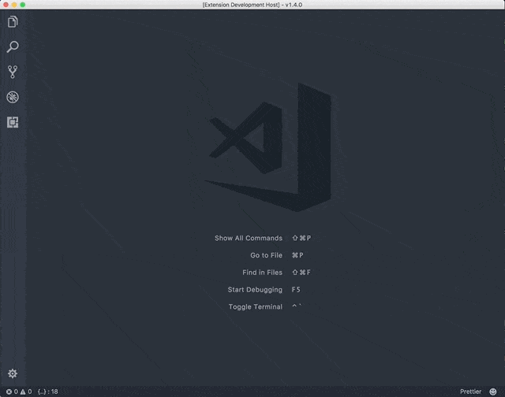
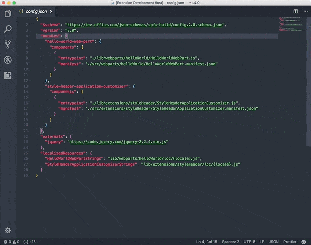

# Rencore SharePoint Framework Script Check Visual Studio Code extension

Using the [Rencore](https://rencore.com) Script Check Visual Studio Code extension you can easily reference external libraries in SharePoint Framework projects the right way.
Additionally, you can ensure, that the CDN they are using is well performing.

> **Info**: To learn more about correctly referencing JavaScript libraries in SharePoint Framework projects, read the [Correctly reference scripts with Rencore Script Check](https://rencore.com/blog/correctly-reference-scripts-rencore-script-check/) article.

## What can this extension do for me

### Check and include an external library in your SharePoint Framework project

Example of including `jQuery` in your project.

> **Info**: for jQuery, the extension will ask you two questions: URL and module name. This is because jQuery is a module. For non-module scripts, you will have to provide more information.

### Add a non-module library to your SharePoint Framework project

Example of including `Cycle` which is a `jQuery` plugin.

## Usage

Start by opening the command prompt:

- Windows `⇧+ctrl+P`
- Mac: `⇧+⌘+P`

Type: `SPFx Script Check` and provide information about the script you want to include in your project.

## Feedback and snippet ideas

If you have ideas for new features or feedback, let us know by creating an issue in the [issue list](https://github.com/rencoreab/vscode-spfx-script-checker/issues).
